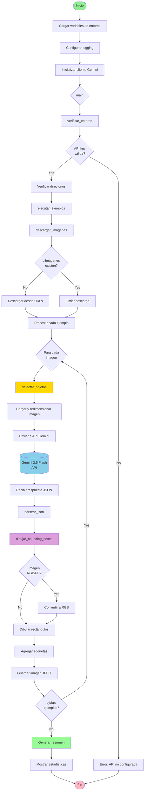

```mermaid
flowchart TD
    Start([Inicio]) --> LoadEnv[Cargar variables de entorno]
    LoadEnv --> ConfigLog[Configurar logging]
    ConfigLog --> InitClient[Inicializar cliente Gemini]

    InitClient --> Main{main}
    Main --> VerifyEnv[verificar_entorno]

    VerifyEnv --> CheckAPI{API key<br/>válida?}
    CheckAPI -->|No| ErrorAPI[Error: API no configurada]
    CheckAPI -->|Yes| CheckDirs[Verificar directorios]

    CheckDirs --> RunExamples[ejecutar_ejemplos]

    RunExamples --> DownloadImages[descargar_imagenes]
    DownloadImages --> CheckImages{¿Imágenes<br/>existen?}
    CheckImages -->|No| Download[Descargar desde URLs]
    CheckImages -->|Yes| Skip[Omitir descarga]

    Download --> ProcessExamples
    Skip --> ProcessExamples

    ProcessExamples[Procesar cada ejemplo]
    ProcessExamples --> DetectLoop{Para cada<br/>imagen}

    DetectLoop --> DetectObjects[detectar_objetos]

    DetectObjects --> LoadImage[Cargar y redimensionar imagen]
    LoadImage --> SendGemini[Enviar a API Gemini]

    SendGemini --> GeminiAPI[(Gemini 2.5 Flash<br/>API)]
    GeminiAPI --> Response[Recibir respuesta JSON]

    Response --> ParseJSON[parsear_json]
    ParseJSON --> DrawBoxes[dibujar_bounding_boxes]

    DrawBoxes --> ConvertRGB{Imagen<br/>RGBA/P?}
    ConvertRGB -->|Yes| ToRGB[Convertir a RGB]
    ConvertRGB -->|No| DrawRect[Dibujar rectángulos]
    ToRGB --> DrawRect

    DrawRect --> AddLabels[Agregar etiquetas]
    AddLabels --> SaveImage[Guardar imagen JPEG]

    SaveImage --> NextExample{¿Más<br/>ejemplos?}
    NextExample -->|Yes| DetectLoop
    NextExample -->|No| Summary

    Summary[Generar resumen]
    Summary --> Stats[Mostrar estadísticas]
    Stats --> End([Fin])

    ErrorAPI --> End

    style Start fill:#90EE90
    style End fill:#FFB6C1
    style GeminiAPI fill:#87CEEB
    style DetectObjects fill:#FFD700
    style DrawBoxes fill:#DDA0DD
    style Summary fill:#98FB98
```